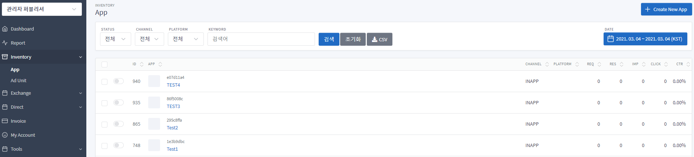
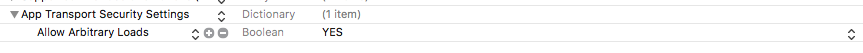
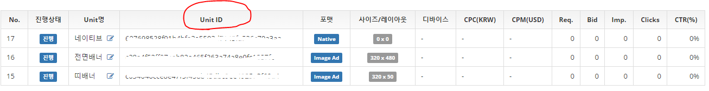

목차
=================

* [Version History](#version-history)
* [시작하기](#시작하기)
* [어플리케이션 설정](#어플리케이션-설정)
  * [ExelBid SDK 추가하기](#exelbid-sdk-추가하기)
* [광고 적용하기](#광고-적용하기)
  * [앱 아이디 등록](#앱-아이디-등록)
  * [인스턴스 공통 메소드](#인스턴스-공통-메소드)
  * [배너광고](#배너광고)
  * [전면 광고](#전면-광고)
  * [네이티브](#네이티브)
  * [네이티브 Adapter](#네이티브-adapter)

## Version History
**Version 1.2.0**
  * _방송통신위원회 시행령 '온라인 맞춤형 광고 개인정보보호 가이드라인' 에 따라서 네이티브 nativePrivacyInformationIconImageView 관련  추가 안내_

# 시작하기

1. 계정을 생성합니다
2. Inventory -> New App을 선택합니다.<br/>


3. 앱정보를 등록한 후, unit을 생성 합니다.


# 어플리케이션 설정

### ExelBid SDK 추가하기

> ExelBid SDK 라이브러리 설치 방법은 CocoaPods로 설치 지원합니다.

### CocoaPods로 설치

[CocoaPods](http://cocoapods.org) 를 이용하여 프로젝트에 라이브러리등을 간단하게 설치하여 사용할 수 있습니다. 자세한 설치 방법은 [CocoaPods](https://guides.cocoapods.org) 홈페이지에서 확인 하실 수 있습니다.

  ```
	$ gem install cocoapods
  ```

#### Podfile

>CocoaPods를 사용하여 ExelBidSDK를 Xcode 프로젝트에 사용하시려면 Podfile에서 ExelBidSDK를 지정하십시오.

  ```
	source 'https://github.com/CocoaPods/Specs.git'
	platform :ios, '8.0'

	target 'TargetName' do
	pod ‘ExelBid_iOS’
	end
  ```

그런 다음, install 명령어를 실행하십시오. 이미 설치 하셨다면 update 하십시오.

  ```
	$ pod install
	or
	$ pod update
  ```

### Xcode 설정하기 (iOS9 이상)

> 해당 프로젝트 info.plist 에서 ‘App Transport Security Settings’ 속성을 추가 해주세요.
하위 아이템으로 ‘Allow Arbitrary Loads’ 추가 후 값은 ‘YES’로 설정하십시오.

 


## 광고 적용하기

### 앱 아이디 등록

> 홈페이지에서 발급받은 App ID 를 최초 한번 등록합니다.

*	setEBAppId(NSString) : 홈페이지에서 발급받은 App ID

 ```
	#import <ExelBidSDK/ExelBidSDK.h>

	- (BOOL)application:(UIApplication *)application didFinishLaunchingWithOptions:(NSDictionary *)launchOptions {

   	 [ExelBidKit setEBAppId:@“앱 아이디”];

 	 return YES;
	}
  ```

### 인스턴스 공통 메소드

>광고의 효율을 높이기 위해 나이, 성별을 설정하는 것이 좋습니다.

*	setYob(NSString) : 태어난 연도 4자리(2016)
*	setGender(NSString) : 성별 (M : 남자, F : 여자)
*	setLocation(CLLocation) : 위치 정보
*	addKeyword(NSString, NSString) : Custom 메타 데이터 (Key, Value)
*	setTesting(BOOL) : 광고의 테스트를 위해 설정하는 값입니다. 통계에 적용 되지 않으며 항상 광고가 노출되게 됩니다.
*	setAdUnitId(String) : 광고 아이디를 셋팅 합니다.

## 배너광고

>띠 배너 형태의 광고를 사용합니다.

1. 사이트로부터 발급 받은 유닛 아이디를 확인합니다.
  

2. EBAdView 인스턴스를 생성 합니다. (홈페이지에서 발급받은 유닛 아이디와 배너뷰의 사이즈를 등록합니다.)
  ```
  - (id)initWithAdUnitId:(NSString *)adUnitId size:(CGSize)size
  ```

  예)
    ```
    self.adView = [[EBAdView alloc] initWithAdUnitId:@“유닛 아이디” size:_adViewContainer.bounds.size];
    self.adView.delegate = self;
    [_adViewContainer addSubview:self.adView];
    ```

3. 광고를 요청 합니다.
  ```
  - (void)loadAd
  ```

  예)
    ```
    [self.adView loadAd];
    ```

4. Protocol References

  > EBAdViewDelegate Protocol Reference
  ```
  - (void)adViewDidLoadAd:(EBAdView *)view  		//광고가 로딩된 시점에 호출 됩니다.
  - (void)adViewDidFailToLoadAd:(EBAdView *)view	//서버로부터 광고를 가져오지 못한 경우에 호출 됩니다.
  - (void)willLoadViewForAd:(EBAdView *)view 		//광고 클릭시 호출 됩니다.
  ```

5. AdView 안에 너비 100%로 웹뷰가 바인딩되게 설정하려면 아래와 같이 메소드를 추가할 수 있습니다. (SDK Version. 1.3.2)

  > 기본 상태는 설정된 광고사이즈로 센터정렬되어 바인딩 된다.

  ```object-c
  setFullWebView(BOOL)
  ```

## 전면 광고

1. 전면 광고 인스턴스를 생성 합니다. (홈페이지에서 발급받은 전면광고 유닛아이디를 등록합니다.)
  ```
  + (EBInterstitialAdController *)interstitialAdControllerForAdUnitId:(NSString *)adUnitId
  ```

  예)
    ```
    self.interstitial = [EBInterstitialAdController interstitialAdControllerForAdUnitId:”유닛 아이디”];
    self.interstitial.delegate = self;
    ```

2. 전면 광고 요청
  ```
  - (void)loadAd
  ```

  예)
    ```
    [self.interstitial loadAd];
    ```

3. 광고 로딩 확인
  ```
  @property (nonatomic, assign, readonly) BOOL ready; //전면 광고를 노출시킬 준비가 되어있는지 체크한다.
  ```

4. 전면 광고 노출
  ```
  - (void)showFromViewController:(UIViewController *)controller // 전면 광고를 노출합니다.
  ```

  예)
    ```
    [self.interstitial showFromViewController:self];
    ```

5. Protocol References

  >EBInterstitialAdControllerDelegate Protocol References
    ```
    - (void)interstitialDidLoadAd:(EBInterstitialAdController *)interstitial	//광고가 로딩된 시점에 호출 됩니다.
    - (void)interstitialWillAppear:(EBInterstitialAdController *)interstitial	//전면 광고가 사용자에게 노출된 시작시 호출됩니다
    - (void)interstitialWillDisappear:(EBInterstitialAdController *)interstitial	//전면 광고가 사용자에게 노출된 시점에 호출됩니다.
    - (void)interstitialDidReceiveTapEvent:(EBInterstitialAdController *)interstitial 	//광고 클릭시 호출 됩니다.
    - (void)interstitialWillDisappear:(EBInterstitialAdController *)interstitial	//사용자가 전면광고를 닫는 시점에 호출 됩니다.
    - (void)interstitialDidDisappear:(EBInterstitialAdController *)interstitial	//전면광고가 닫힌 후 호출 됩니다.
    - (void)interstitialDidFailToLoadAd:(EBInterstitialAdController *)interstitial	//서버로부터 광고를 가져오지 못한 경우에 호출 됩니다.
    ```

## 네이티브

1. 네이티브 광고 인스턴스를 생성합니다. (홈페이지에서 발급받은 유닛 아이디와 배너 클래스를 등록합니다.)

  ```
  + (void)initNativeAdWithAdUnitIdentifier:(NSString *)identifier adViewClass:(Class)adViewClass
  ```

  예)
    ```
    [ExelBidNativeManager initNativeAdWithAdUnitIdentifier:”유닛아이디” adViewClass:[EBNativeAdView class]];
    ```

2. 광고가 노출될 영역에 대한 정보를 렌더링 합니다.

  >EBNativeAdRendering Protocol References
    ```
    - (UILabel *)nativeMainTextLabel;
    - (UILabel *)nativeTitleTextLabel;
    - (UIImageView *)nativeIconImageView;
    - (UIImageView *)nativeMainImageView;
    - (UIView *)nativeVideoView;
    - (UILabel *)nativeCallToActionTextLabel;
    - (UIImageView *)nativePrivacyInformationIconImageView;
    - (void)layoutStarRating:(NSNumber *)starRating;
    ```

    - ``@interface EBNativeAdView : UIView<EBNativeAdRendering>`` // 네이티브 광고가 노출 되어야 하는 View를 설정합니다. 광고요청시 설정되는 항목으로는 제목, 상세설명, 메인이미지, 아이콘, 별점, 액션 버튼의 텍스트가 있으며, 어플리케이션에서 사용할 항목만 NativeView에 설정하면 됩니다.
    - ``(UIImageView *)nativeMainImageView`` //생성자에 설정한 View에 포함되어 있는 광고의 메인 이미지가 노출될 ImageView의 id를 설정합니다.
    - ``(UILabel *)nativeCallToActionTextLabel``  //생성자에 설정한 View에 포함되어 있는 광고의 ActionButton id를 설정합니다. 해당 Button에 텍스트가 설정 됩니다.
    - ``(UILabel *)nativeTitleTextLabel`` //생성자에 설정한 View에 포함되어 있는 광고의 제목이 설정 될 TextView의 id를 설정합니다.
    - ``(UILabel *)nativeMainTextLabel`` //생성자에 설정한 View에 포함되어 있는 광고의 설명이 설정 될 TextView의 id를 설정합니다.
    - ``(UIImageView *)nativeIconImageView``  //생성자에 설정한 View에 포함되어 있는 광고의 아이콘이 노출될 ImageView의 id를 설정합니다.
    - ``(void)layoutStarRating:(NSNumber *)starRating`` // 생성자에 설정한 View에 포함되어 있는 광고의 별점이 표시될 RatingBar의 id를 설정합니다.
    - ``(UIImageView *)nativePrivacyInformationIconImageView`` // 생성자에 설정한 View에 포함되어 있는 광고 정보 표시 아이콘이 노출될 ImageView를 설정합니다. 해당 ImageView의 속성에 기본 Info 아이콘이 바이딩 됩니다.
   _**2017/07 방송통신위원회에서 시행되는 '온라인 맞춤형 광고 개인정보보호 가이드라인' 에 따라서 필수 적용 되어야 합니다.
    광고주측에서 제공하는 해당 광고의 타입(맞춤형 광고 여부)에 따라 정보 표시 아이콘(Opt-out)의 노출이 결정됩니다.
    ※ 광고 정보 표시 아이콘이 노출될 ImageView의 사이즈는 NxN(권장 20x20)으로 설정 되어야 합니다.**_

3. 광고 로딩을 시작 합니다.

  ```
  + (void)startWithCompletionHandler:(EBNativeAdRequestHandler)handler
  ```

  >Block References
    ```
    typedef void(^EBNativeAdRequestHandler)(EBNativeAdRequest *request,
                                        EBNativeAd *response,			//광고 데이터를 가져옵니다.
                                        NSError *error);
    ```

  예)
    ```
      [ExelBidNativeManager startWithCompletionHandler:^(EBNativeAdRequest *request, EBNativeAd *response, NSError *error) {
          if (error) {
          } else {
              self.nativeAd = response;
              self.nativeAd.delegate = self;
          }
      }];
    ```

4. 네이티브 광고 노출

  ```
  - (UIView *)retrieveAdViewWithError:(NSError **)error;
  ```

  예)
    ```
    UIView *adView = [self.nativeAd retrieveAdViewWithError:nil];
    [self.adViewContainer addSubview:adView];
    ```

5. Protocol References

  >EBNativeAdDelegate Protocol References
    ```
    - (void)willLoadForNativeAd:(EBNativeAd *)nativeAd	//광고 클릭시 호출 됩니다.
    ```

## 네이티브 Adapter

>UITableView, UICollectionView등과 같이 한 BaseAdapter를 이용한 컴포넌트 활용시에 사용할수 있는 방법입니다.

1. EBNativeAdRequestTargeting 객체 생성

  ```
  + (EBNativeAdRequestTargeting *)targeting
  ```

  예)
    ```
    EBNativeAdRequestTargeting *targeting = [EBNativeAdRequestTargeting targeting];
    ```

2. 네이티브 광고 설정

  - ``EBNativeAdRendering Protocol References``   //광고가 노출될 영역에 대한 정보를 렌더링 합니다.
    ```
    - (UILabel *)nativeMainTextLabel;
    - (UILabel *)nativeTitleTextLabel;
    - (UIImageView *)nativeIconImageView;
    - (UIImageView *)nativeMainImageView;
    - (UIView *)nativeVideoView;
    - (UILabel *)nativeCallToActionTextLabel;
    - (UIImageView *)nativePrivacyInformationIconImageView;
    - (void)layoutStarRating:(NSNumber *)starRating;
    ```

  - ``(void)setDesiredAssets:(NSSet *)desiredAssets`` //네이티브 광고 요청시 어플리케이션에서 필수로 요청할 항목들을 설정합니다.

      예)
       ```
       targeting.desiredAssets = [NSSet setWithObjects:kAdIconImageKey,
                                   kAdMainImageKey,
                                  kAdCTATextKey,
                                  kAdTextKey,
                                  kAdTitleKey,
                                   nil];
       ```

3. 광고가 노출될 영역을 설정 한다

  >광고가 노출될 UITableView 및 UICollectionView 의 사이즈 셋팅후   EBTableViewAdPlacer 인스턴스를 생성한다

  ```
  + (instancetype)placerWithTableView:(UITableView *)tableView viewController:(UIViewController *)controller rendererConfigurations:(NSArray *)rendererConfigurations;
  + (instancetype)placerWithCollectionView:(UICollectionView *)collectionView viewController:(UIViewController *)controller rendererConfigurations:(NSArray *)rendererConfigurations;
  ```

  예)
    ```
    EBStaticNativeAdRendererSettings *nativeAdSettings = [[EBStaticNativeAdRendererSettings alloc] init];
    nativeAdSettings.renderingViewClass = [EBTableViewAdPlacerView class];	//네이티브 광고영역뷰 클래스
    nativeAdSettings.viewSizeHandler = ^(CGFloat maximumWidth) {
        return CGSizeMake(maximumWidth, 330.0f);
    };
    EBNativeAdRendererConfiguration *nativeAdConfig = [EBStaticNativeAdRenderer rendererConfigurationWithRendererSettings:nativeAdSettings];
    self.placer = [EBTableViewAdPlacer placerWithTableView:self.tableView viewController:self rendererConfigurations:@[nativeAdConfig]];
    self.placer.delegate = self;
    ```

4. 리스트뷰에 어뎁터를 설정한다.

  ```
  - (void)loadAdsForAdUnitID:(NSString *)adUnitID targeting:(EBNativeAdRequestTargeting *)targeting
  ```

  예)
    ```
    [self.placer loadAdsForAdUnitID:”유닛아이디” targeting:”EBNativeAdRequestTargeting 객체”];
    ```
